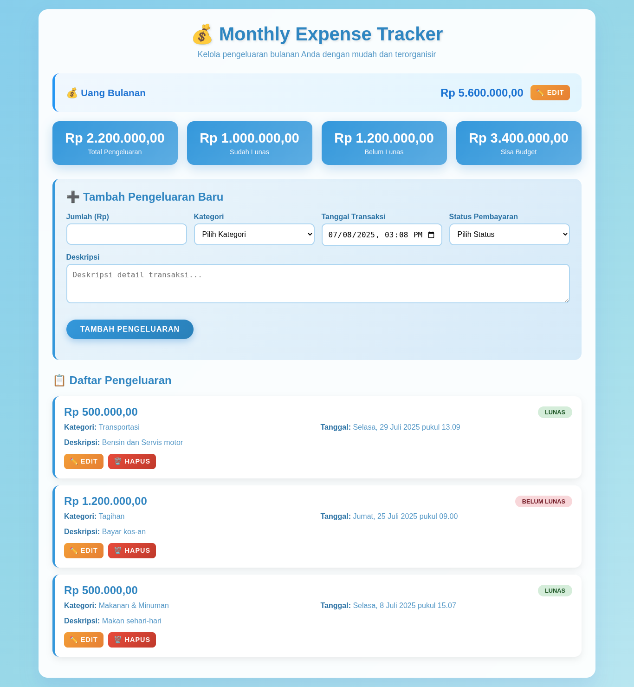

  

---

# 💰 Monthly Expense Tracker

<div align="center">

**Created by [Rizkyyullah](https://github.com/Rizkyyullah)**

🗓️ **Created:** 7/8/2025 | 🔄 **Last Updated:** 7/8/2025

</div>

## 📖 About

Aplikasi web untuk mengelola pengeluaran bulanan dengan antarmuka yang intuitif dan fitur-fitur lengkap untuk memantau keuangan pribadi.

## 🛠️ Tech Stack

<div align="center">

  

</div>

## 🌟 Fitur Utama

- **📊 Dashboard Keuangan**: Tampilan ringkasan pengeluaran dengan statistik real-time
- **💳 Manajemen Budget**: Set dan monitor budget bulanan dengan peringatan otomatis
- **📝 Pencatatan Pengeluaran**: Tambah, edit, dan hapus transaksi dengan mudah
- **🏷️ Kategori Pengeluaran**: Organisasi pengeluaran berdasarkan kategori (Makanan, Transportasi, dll.)
- **📅 Tracking Waktu**: Pencatatan tanggal dan waktu transaksi
- **✅ Status Pembayaran**: Monitor status lunas/belum lunas
- **📱 Responsive Design**: Tampilan optimal di desktop dan mobile
- **💾 Data Persistence**: Penyimpanan data lokal menggunakan localStorage

## 🎯 Screenshot



## 🚀 Demo

[Live Demo](https://rizkyyullah.github.io/monthly-expense-tracker)

## 📋 Kategori Pengeluaran

- 🍽️ Makanan & Minuman
- 🚗 Transportasi
- 🛒 Belanja
- 📄 Tagihan
- 🎬 Hiburan
- ⚕️ Kesehatan
- 📚 Pendidikan
- 📦 Lainnya

## 🛠️ Teknologi yang Digunakan

- **HTML5**: Struktur aplikasi
- **CSS3**: Styling dengan gradient modern dan animasi
- **JavaScript (ES6+)**: Logika aplikasi dan manipulasi DOM
- **LocalStorage API**: Penyimpanan data lokal
- **Responsive Design**: CSS Grid dan Flexbox

## 📦 Instalasi

### 1. Clone Repository

```bash
git clone https://github.com/username/monthly-expense-tracker.git
cd monthly-expense-tracker
```

### 2. Buka di Browser

```bash
# Buka file index.html di browser favorit Anda
# Atau gunakan live server jika tersedia
```

### 3. Alternatif: Gunakan Live Server

```bash
# Jika menggunakan VS Code dengan Live Server extension
# Klik kanan pada index.html → Open with Live Server
```

## 🎮 Cara Penggunaan

### 1. Set Budget Bulanan

- Masukkan jumlah gaji/uang bulanan Anda
- Klik "Set Budget" untuk menyimpan

### 2. Tambah Pengeluaran

- Isi form "Tambah Pengeluaran Baru"
- Pilih kategori yang sesuai
- Tentukan status pembayaran (Lunas/Belum Lunas)
- Klik "Tambah Pengeluaran"

### 3. Monitor Keuangan

- Lihat statistik di dashboard (Total Pengeluaran, Sudah Lunas, Belum Lunas, Sisa Budget)
- Perhatikan peringatan jika pengeluaran melebihi budget

### 4. Kelola Pengeluaran

- Edit: Klik tombol "✏️ Edit" pada kartu pengeluaran
- Hapus: Klik tombol "🗑️ Hapus" untuk menghapus transaksi

## 🎨 Fitur UI/UX

### Sistem Peringatan Budget

- **⚠️ Peringatan (Orange)**: Pengeluaran melebihi budget Rp 1.000 - Rp 100.000
- **🚨 Bahaya (Red)**: Pengeluaran melebihi budget lebih dari Rp 100.000

### Responsif Design

- Tampilan optimal di desktop (>768px)
- Layout adaptif untuk tablet (768px - 480px)
- UI mobile-friendly (<480px)

## 🔧 Konfigurasi

### Format Mata Uang

Aplikasi menggunakan format mata uang Indonesia (IDR) dengan `Intl.NumberFormat`:

```javascript
function formatCurrency(amount) {
	return new Intl.NumberFormat('id-ID', {
		style: 'currency',
		currency: 'IDR',
		minimumFractionDigits: 2,
	}).format(amount);
}
```

### Penyimpanan Data

Data disimpan di localStorage dengan key:

- `monthly_expense_tracker.expense.data` - Data pengeluaran
- `monthly_expense_tracker.monthly.budget` - Budget bulanan

## 🐛 Troubleshooting

### Data Tidak Tersimpan

- Pastikan browser mendukung localStorage
- Periksa apakah ada pembatasan storage di browser
- Coba bersihkan cache browser

### Tampilan Tidak Responsif

- Pastikan viewport meta tag ada di HTML
- Periksa CSS media queries
- Refresh halaman atau clear cache

## 🚀 Pengembangan Lebih Lanjut

### Fitur yang Bisa Ditambahkan

- 📈 Grafik dan chart untuk visualisasi data
- 📤 Export data ke Excel/CSV
- 🔄 Sync dengan cloud storage
- 📊 Laporan bulanan otomatis
- 🎯 Target saving dan goals
- 📱 Progressive Web App (PWA)
- 🌙 Dark mode theme

### Kontribusi

1. Fork repository ini
2. Buat branch fitur baru (`git checkout -b feature/AmazingFeature`)
3. Commit perubahan (`git commit -m 'Add some AmazingFeature'`)
4. Push ke branch (`git push origin feature/AmazingFeature`)
5. Buat Pull Request

## 👨‍💻 Author

**Your Name**

- GitHub: [@Rizkyyullah](https://github.com/Rizkyyullah)
- Email: m.alirizkyyullah@gmail.com
